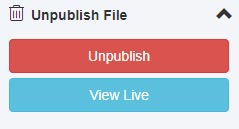

# Unpublished Gadget

A Gadget for OMNI Update that will unpublish a file from the production server but leave it on the staging server. It also provides a link to view the production version of the page.

## Installing in OmniUpdate

You can host the gadget files locally by cloning this repository or downloading the zip file and uploading the files to your server. If you don’t want to host it locally, you can add the gadget via GitHub Pages with this URL: http://jessgusclark.github.io/gadget-unpublished/

To install the gadget, use [OmniUpdate's Instructions](http://support.omniupdate.com/oucampus10/setup/gadgets/new-gadget.html) and when prompted for the **URL of the gadget source folder** use your server or the GitHub Pages url: https://jessgusclark.github.io/gadget-unpublished/
